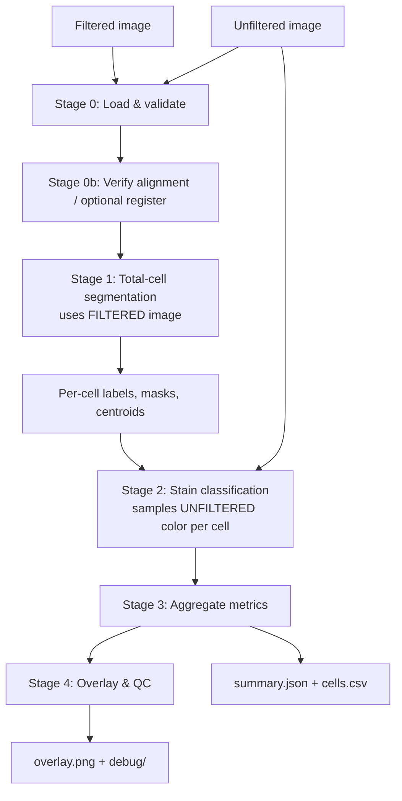

# Cell Counting & Stain Classification — Design Plan

**Goal:** A Python program that takes a *matched pair* of microscopy images of the same field — a **filtered** image and an **unfiltered** image — and reports:

1. **Total cell count** — every cell in the field, stained or not.
2. **Stained cell count** — cells showing blue/teal staining (β‑gal / X‑gal‑style positive cells), read from the *unfiltered* image.

Derived readouts (percent positive, per‑cell table, annotated overlay) come for free once those two numbers exist.

---

## 1. Design rationale: why two images

Each image plays to a different strength, and the program is built around that division of labor:

| Image | What it looks like | Role in the pipeline |
|---|---|---|
| **Filtered** (`c1_Filtered.png`) | All cells appear as **dark blobs on a uniform blue field**; color information is gone. | **Segmentation / total count.** Uniform background + high contrast make *every* cell easy to detect regardless of its true color. |
| **Unfiltered** (`c1_Unfiltered.jpg`) | True color: pale cream/yellow background, **cream/yellow (negative)** cells and **dark teal (positive)** cells, plus debris and filaments. | **Classification.** Holds the color needed to call each detected cell *stained* vs *unstained*. |

The core idea: **detect once on the filtered image, then look up color at each cell's location in the unfiltered image.** This is far more robust than trying to do both jobs on the unfiltered image alone, where the warm background cast, debris, and variable cell color make total segmentation hard.

---

## 2. What the data actually looks like (measured)

These facts were measured directly from the provided pair and **drive the default parameters** below. Re‑measure per dataset; do not hard‑code blindly.

- **Resolution:** both images are `3840 × 2160` and **pixel‑aligned** (same field, same crop). The program still verifies this every run and can register if a future pair is misaligned (§5.1).
- **Filtered image:** information lives entirely in the **blue channel** (R = G = 0). Background blue ≈ 146; cells are dark. There is a brightness gradient/vignette across the frame, so a *global* threshold is unsafe — background must be estimated locally.
- **Unfiltered image:** strong **warm cast**. Field (non‑cell) background ≈ BGR `(96, 137, 152)` → red > green > blue. **Consequence: absolute color thresholds fail.** "Blueness" must be measured *relative to the per‑image field background.* (A naive LAB `b* < neutral` test classified 0/281 cells correctly because the whole image is yellow‑shifted.)
- **The stain is teal, not pure blue.** Positive cells sit at OpenCV hue ≈ 55–95 (≈ 110–190° standard) and are relatively dark; negative cells sit at hue ≈ 20 (yellow) with high saturation. There is a usable gap around hue ≈ 35–50.
- **Scale:** a single cell ≈ 60–75 px diameter, area ≈ 3,000–4,000 px². Cells frequently touch and form clusters → splitting is required.
- **Prototype counts on this field:** total ≈ **281** (stable in 260–290 across reasonable parameters); stained ≈ **60–150** depending on the stain threshold (≈ 97 at a mid setting). The stained count's threshold sensitivity is real and is treated as a first‑class calibration problem (§8).

---

## 3. Inputs & outputs

### Inputs
- `--filtered PATH` — filtered image (PNG/JPG/TIFF).
- `--unfiltered PATH` — unfiltered image of the **same field**.
- `--out DIR` — output directory.
- `--config PATH` *(optional)* — YAML overriding any default parameter.
- Flags: `--save-overlay`, `--save-csv`, `--save-debug`, `--stain-threshold FLOAT`, `--no-watershed`.

### Outputs (written to `--out`)
- **`summary.json`** — headline numbers + parameters + QC, e.g.:
  ```json
  {
    "image_id": "c1",
    "total_cells": 281,
    "stained_cells": 97,
    "unstained_cells": 184,
    "percent_stained": 34.5,
    "qc": {
      "possible_doublets": 15,
      "median_cell_area_px": 3877,
      "field_background_bgr": [96, 137, 152],
      "stain_threshold_used": 0.20,
      "count_robustness_band": [260, 290]
    },
    "parameters": { "...": "all resolved params for reproducibility" },
    "version": "0.1.0"
  }
  ```
- **`cells.csv`** — one row per cell (schema in §6).
- **`overlay.png`** — unfiltered image with stained cells outlined in one color, unstained in another, and the count printed.
- **`debug/`** *(optional)* — background map, darkness map, binary mask, distance transform, seeds, stain mask — for tuning and QC.

---

## 4. Pipeline architecture



---

## 5. Stage specifications

### 5.0 Load & validate (`io_utils.py`)
- Read both images (OpenCV, BGR). Reject unreadable/empty files with clear errors.
- Confirm both are 3‑channel; record original dtypes/sizes.
- If sizes differ, resize the unfiltered to the filtered's resolution **after** the alignment step (§5.1), not before.

### 5.1 Alignment / registration (`registration.py`)
- **Verify first, register only if needed.** For the provided pair, images are already pixel‑aligned, so this is a cheap no‑op; but the program must not *assume* that for arbitrary inputs.
- Cheap check: downscale both, compute normalized cross‑correlation of edge maps; if peak offset ≈ 0 and scale ≈ 1, mark `aligned=True` and skip.
- If misaligned: estimate a transform with **phase correlation** (translation/scale) or **ECC** (`cv2.findTransformECC`, affine), falling back to ORB feature matching + homography for harder cases. Warp the unfiltered onto the filtered's frame.
- Emit a QC value (residual alignment error) into `summary.json`; warn loudly if it's large, since misalignment silently corrupts classification.

### 5.2 Total‑cell segmentation — **filtered image** (`segmentation.py`)
This is the validated turn‑1 pipeline. All sizes scale with the measured cell diameter so the same code works at other magnifications.

1. **Channel select & denoise.** Take the blue channel; Gaussian blur (σ ≈ 2 px).
2. **Background estimation.** Grayscale morphological **closing** with an elliptical kernel larger than one cell (≈ 101 px ≈ 1.5× cell diameter). Closing fills the dark cell "holes," yielding the local bright‑field background — this handles the vignette/gradient.
3. **Darkness map.** `darkness = background − blurred`. Cells become bright peaks on a flat zero field.
4. **Threshold.** Otsu on the darkness map → binary cell mask. (Otsu on the *response* is robust because background subtraction has flattened illumination.)
5. **Clean up.** Morphological open (remove specks) then close (fill pinholes); small elliptical kernels (≈ 5 and 7 px).
6. **Split touching cells (watershed).**
   - Distance transform of the mask, smoothed (σ ≈ 2).
   - Seeds = local maxima (`peak_local_max`, `min_distance` ≈ 18 px ≈ 0.5× cell radius, `threshold_abs` ≈ 0.3× max distance).
   - `watershed(−distance, seeds, mask=binary)`.
7. **Filter regions.** Drop labels with area < `min_cell_area` (≈ 250 px²) as noise; flag area > `doublet_factor × median` (≈ 1.8×) as **possible doublets** (under‑split clusters) rather than discarding.
8. **Output per cell:** integer label image, binary mask, centroid, area, equivalent diameter, border‑touch flag.

**Tunables (defaults from this dataset):** `closing_kernel=101`, `blur_sigma=2`, `min_distance=18`, `peak_rel_thresh=0.30`, `min_cell_area=250`, `doublet_factor=1.8`. All derived from `expected_cell_diameter_px≈70`; expose that single knob to rescale everything.

### 5.3 Stain classification — **unfiltered image** (`classification.py`)
Decide, per detected cell, stained vs unstained. This is the subtler stage; treat it as a configurable color classifier, not a fixed rule.

**Principle — measure color relative to the per‑image field background.** Because of the warm cast (§2), compute the field background color once per run from non‑cell pixels (`label == 0`, eroded away from cells), then express every cell's color relative to it.

**Per‑cell color features** (computed on the **cell core** — the mask eroded a few px, or the densest/most‑saturated pixels — to avoid dilution by pale halos):

- **Teal‑pixel fraction** *(recommended primary)* — fraction of core pixels with hue in the teal window (OpenCV ≈ 45–105) and saturation above a floor (≈ 35). Negative cells → near 0; positive cells → high.
- **Relative blueness** — `median(B − R)` of the core minus the field's `(B − R)`. Yellow cells strongly negative, teal cells strongly positive.
- **Median hue / saturation / value** of the core (value doubles as a darkness cue — stain is dark).

**Decision rule (two interchangeable options; ship both, default to A):**

- **A. Calibrated threshold** on the primary feature (e.g. `teal_fraction > stain_threshold`, default ≈ 0.20). Simple, fast, but the threshold must be calibrated per assay/microscope (§8). Record `stain_confidence` = signed distance from the threshold.
- **B. Unsupervised 2‑class split** — fit a 2‑component Gaussian mixture / k‑means on the per‑cell feature vector `[teal_fraction, relative_blueness, value]` and label the bluer/darker cluster as stained. **Adapts to each image automatically**, reducing manual threshold tuning; falls back to A if the two clusters aren't separable (e.g. an all‑negative field).

**Known limitations to handle (observed in the prototype overlay):**
- Threshold sensitivity: stained count ≈ 60–150 over the plausible threshold range → calibration matters; always emit the count *and* the threshold, and offer a threshold‑sweep report.
- Very dark teal cells can read as low‑saturation → don't gate on saturation alone; combine hue **and** value.
- Faint/partial staining is genuinely ambiguous → expose a "borderline" band and optionally a third `ambiguous` class for review.

### 5.4 Aggregate metrics (`metrics.py`)
- `total = len(kept cells)`; `stained = sum(is_stained)`; `unstained = total − stained`; `percent_stained`.
- QC roll‑ups: possible‑doublet count, median/mean area, field background color, alignment residual, fraction of border cells.
- Optional **doublet correction:** estimate hidden cells in over‑sized regions (area ÷ median, rounded) and report a corrected total as a *separate* number — never silently inflate the primary count.

### 5.5 Visualization & QC (`visualization.py`)
- `overlay.png`: stained cells one outline color, unstained another, doublets a third; counts printed; legend baked in.
- Optional debug panel: background map, darkness map, mask, distance transform + seeds, teal mask — the artifacts needed to diagnose a bad run.
- Optional: per‑cell feature histograms (teal fraction, area) to make threshold choice visual.

---

## 6. Data structures

```python
@dataclass
class CellRecord:
    id: int
    centroid_x: float
    centroid_y: float
    area_px: int
    equiv_diameter_px: float
    # color (unfiltered, measured on core, relative to field bg)
    teal_fraction: float
    relative_blueness: float      # (B-R)_core - (B-R)_field
    median_hue: float
    median_saturation: float
    median_value: float
    # classification
    is_stained: bool
    stain_confidence: float        # signed distance from decision boundary
    # QC flags
    on_border: bool
    possible_doublet: bool
    is_debris: bool                # failed shape/size sanity (filaments, scratches)
```

`cells.csv` = one `CellRecord` per row. Stable column order; floats rounded sensibly.

---

## 7. Project structure & dependencies

```
cell_counter/
├── __init__.py
├── cli.py            # argparse entry point; orchestrates stages
├── config.py         # Config dataclass, YAML load, expected_cell_diameter rescaling
├── io_utils.py       # load/validate images, write json/csv
├── registration.py   # alignment verify + optional warp
├── segmentation.py    # Stage 1: total-cell detection (filtered)
├── classification.py # Stage 2: stain classification (unfiltered)
├── metrics.py        # Stage 3: aggregate
├── visualization.py  # Stage 4: overlays, debug, histograms
└── pipeline.py       # run_pipeline(filtered, unfiltered, cfg) -> Result
configs/
└── default.yaml      # all tunables with documented defaults
tests/
├── test_segmentation.py
├── test_classification.py
├── test_registration.py
└── fixtures/         # tiny synthetic + a real labeled crop
```

**Dependencies:** `numpy`, `opencv-python`, `scikit-image`, `scipy`, `pandas` (CSV), `pyyaml` (config). Optional: `scikit-learn` (GMM/k‑means for the unsupervised classifier). Python 3.10+. All already proven to work in the prototype environment.

---

## 8. Validation & calibration strategy

The single most important practical step, because the **stained** count is threshold‑driven.

1. **Ground truth.** Hand‑label a few fields (total + stained) using a point‑annotation tool. Even one well‑labeled field calibrates the stain threshold.
2. **Segmentation accuracy.** Match detected centroids to truth (Hungarian assignment within a radius); report precision/recall/F1 and over/under‑segmentation rates.
3. **Classification accuracy.** On matched cells, report stained‑vs‑unstained confusion matrix and F1.
4. **Threshold sweep.** Sweep `stain_threshold`, plot stained count and (if truth exists) F1 vs threshold; pick the operating point and record it. Ship this as a `--calibrate` subcommand.
5. **Robustness band.** Re‑run total segmentation across a small parameter grid (`min_distance`, area floor) and report the count range (e.g. 260–290) as an honest uncertainty, not a single deceptively precise number.
6. **Consistency, not just accuracy.** For comparing conditions/wells, a *consistent* threshold across all images matters more than perfect per‑image accuracy — keep parameters fixed within an experiment.

---

## 9. Testing strategy
- **Unit tests** on synthetic images: known disc count and known stained/unstained split → assert exact recovery; touching discs → assert watershed splits them; an all‑negative field → assert stained = 0 and the unsupervised classifier falls back gracefully.
- **Registration tests:** shift/scale a copy and assert it's recovered.
- **Regression test:** pin this dataset's total to the 260–290 band and stained to a band at the chosen threshold; fail if a refactor moves outside it.
- **Property tests:** `unstained == total − stained`; counts invariant to a pure global brightness shift after background normalization.

---

## 10. Edge cases & failure modes

| Case | Handling |
|---|---|
| Touching / overlapping cells | Distance‑transform watershed; oversized survivors flagged as doublets and optionally count‑corrected. |
| Debris, filaments, scratches | Shape sanity (area + solidity/elongation) → `is_debris` flag, excluded from counts; surfaced in debug. |
| Cells clipped at the image border | `on_border` flag; optionally exclude (stereology convention) or count — user‑configurable. |
| Warm/variable color cast | All color features measured **relative to per‑image field background**; never absolute. |
| Misaligned filtered/unfiltered pair | Verified each run; registered or warned. |
| Faint / partial staining | Borderline band + optional `ambiguous` class; threshold sweep documents the impact. |
| Different magnification/resolution | Single `expected_cell_diameter_px` knob rescales every kernel/distance. |
| Empty or hugely overcrowded field | Guard rails: 0 cells handled cleanly; warn when foreground fraction is implausibly high (confluent → counts unreliable). |

---

## 11. CLI usage

```bash
# Standard run
python -m cell_counter.cli \
    --filtered   c1_Filtered.png \
    --unfiltered c1_Unfiltered.jpg \
    --out        results/c1 \
    --save-overlay --save-csv

# Override the stain threshold and dump debug artifacts
python -m cell_counter.cli --filtered c1_Filtered.png --unfiltered c1_Unfiltered.jpg \
    --out results/c1 --stain-threshold 0.25 --save-debug

# Calibrate the threshold against a labeled field
python -m cell_counter.cli calibrate --filtered f.png --unfiltered u.jpg --truth labels.csv
```

Exit non‑zero on validation failure (bad input, large alignment residual) so it can be scripted in a batch loop.

---

## 12. Roadmap (post‑v1)
- **Batch mode:** point at a folder of `*_Filtered`/`*_Unfiltered` pairs → one aggregated CSV + per‑image overlays; group by condition for plots.
- **Better segmentation:** swap the classical watershed for a pretrained instance model (**Cellpose** or **StarDist**) when clusters are dense; keep the classical path as a no‑GPU fallback.
- **Learned stain classifier:** small model on per‑cell color patches once enough labels exist, replacing the hand‑tuned threshold.
- **Flat‑field / white‑balance correction** on the unfiltered image to shrink between‑image color drift before classification.
- **Review GUI:** Napari/Streamlit overlay where a user corrects misclassifications and the threshold auto‑updates.
- **One‑image fallback:** derive the "filtered" representation internally from the unfiltered image so the tool degrades to a single input when no filtered copy exists.

---

## 13. Open questions for you
1. **Stain‑positive definition:** is *any* visible teal enough, or only cells stained above some intensity/area fraction? This sets the default threshold and whether we keep an `ambiguous` class.
2. **Border cells:** include partially‑clipped cells in counts, or exclude them?
3. **Ground truth:** do you have (or can you make) a hand count for even one field? It would let me calibrate and report real accuracy instead of an uncertainty band.
4. **Scale:** one field at a time, or batches of many image pairs to aggregate?
5. **Assay:** confirming this is X‑gal / SA‑β‑gal (blue‑teal positive). The color model assumes a teal precipitate; a different stain shifts the hue window.

---

### Appendix A — validated core snippets

**Total segmentation (filtered):**
```python
blue = filtered[:, :, 0]
sm   = cv2.GaussianBlur(blue, (0, 0), 2.0)
bg   = cv2.morphologyEx(sm, cv2.MORPH_CLOSE,
                        cv2.getStructuringElement(cv2.MORPH_ELLIPSE, (101, 101)))
dark = cv2.subtract(bg, sm)
_, mask = cv2.threshold(dark, 0, 255, cv2.THRESH_BINARY + cv2.THRESH_OTSU)
# open+close cleanup, then:
dist  = cv2.GaussianBlur(cv2.distanceTransform(mask, cv2.DIST_L2, 5), (0, 0), 2.0)
seeds = peak_local_max(dist, min_distance=18, threshold_abs=0.30*dist.max(), labels=mask)
labels = watershed(-dist, ndi.label(points_to_image(seeds))[0], mask=mask)
cells  = [r for r in regionprops(labels) if r.area >= 250]
```

**Stain classification (unfiltered), background‑relative teal fraction:**
```python
field   = ~ndi.binary_dilation(labels > 0, iterations=15)
bg_BR   = np.median(B[field]) - np.median(R[field])          # warm-cast reference
hsv     = cv2.cvtColor(unfiltered, cv2.COLOR_BGR2HSV)
H, S    = hsv[:, :, 0], hsv[:, :, 1]
teal_px = (H >= 45) & (H <= 105) & (S >= 35)                  # teal precipitate
for cell in cells:
    core = erode(cell.mask, 2)
    cell.teal_fraction     = teal_px[core].mean()
    cell.relative_blueness = np.median((B - R)[core]) - bg_BR
    cell.is_stained        = cell.teal_fraction > STAIN_THRESHOLD   # or GMM cluster
```

> **Status:** Stages 0–4 were prototyped end‑to‑end on the provided pair; total ≈ 281 (band 260–290), stained ≈ 97 at `stain_threshold = 0.20`. The numbers and every default above are measured from that run, so this plan is implementation‑ready rather than speculative.
